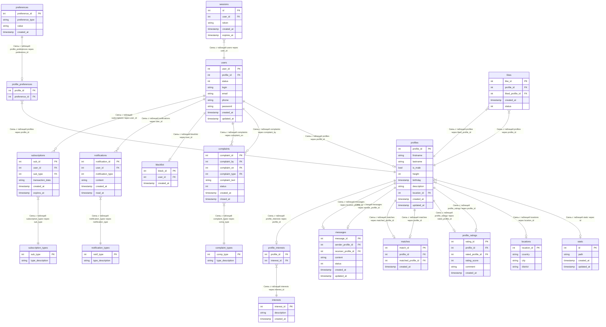

# ER Диаграмма базы данных

```mermaid
erDiagram

    static {
        int id PK
        string path
        timestamp created_at
        timestamp updated_at
    }

    sessions {
        int id PK
        int user_id FK
        string token
        timestamp created_at
        timestamp expires_at
    }

    users {
        int user_id PK
        int profile_id FK
        int status
        string login
        string email
        string phone
        string password
        timestamp created_at
        timestamp updated_at
    }

    profiles {
        int profile_id PK
        string firstname
        string lastname
        bool is_male
        int height
        timestamp birthday
        string description
        int location_id FK
        timestamp created_at
        timestamp updated_at
    }

    interests {
        int interest_id PK
        string description
        timestamp created_at
    }

    profile_interests {
        int profile_id FK
        int interest_id FK
    }

    preferences {
        int preference_id PK
        string preference_type  
        string value            
        timestamp created_at
    }

    profile_preferences {
        int profile_id FK
        int preference_id FK
    }

    locations {
        int location_id PK
        string country
        string city
        string district
    }

    messages {
        int message_id PK
        int sender_profile_id FK
        int receiver_profile_id FK
        string content
        int status
        timestamp created_at
        timestamp updated_at
    }

    likes {
        int like_id PK
        int profile_id FK
        int liked_profile_id FK
        timestamp created_at
        int status
    }

    matches {
        int match_id PK
        int profile_id FK
        int matched_profile_id FK
        timestamp created_at
    }

    subscriptions {
        int sub_id PK
        int user_id FK
        int sub_type FK
        string transaction_data
        timestamp created_at
        timestamp expires_at
    }

    subscription_types {
        int sub_type PK
        string type_description
    }

    complaints {
        int complaint_id PK
        int complaint_by FK
        int complaint_on FK
        int complaint_type FK
        string complaint_text
        int status
        timestamp created_at
        timestamp closed_at
    }

    complaint_types {
        int comp_type PK
        string type_description
    }

    blacklist {
        int block_id PK
        int user_id FK
        timestamp created_at
    }

    notifications {
        int notification_id PK
        int user_id FK
        int notification_type
        string content
        timestamp created_at
        timestamp read_at
    }

    notification_types {
        int notif_type PK
        string type_description
    }

    profile_ratings {
        int rating_id PK
        int profile_id FK
        int rated_profile_id FK
        int rating_score
        string comment
        timestamp created_at
    }

    %% Связи

    sessions }|--|| users : "Связь с таблицей users через user_id"
    users ||--o| profiles : "Связь с таблицей profiles через profile_id"
    users ||--o{ complaints : "Связь с таблицей complaints через complaint_by"
    users ||--o{ complaints : "Связь с таблицей complaints через complaint_on"
    users ||--o| blacklist : "Связь с таблицей blacklist через user_id"
    users ||--o{ notifications : "Связь с таблицей notifications через user_id"
    users ||--o{ subscriptions : "Связь с таблицей subscriptions через user_id"

    profiles }|--o| static : "Связь с таблицей static через id"
    profiles }|--o| locations : "Связь с таблицей locations через location_id"
    profiles ||--o| profile_ratings : "Связь с таблицей profile_ratings через profile_id"
    profiles ||--o| profile_ratings : "Связь с таблицей profile_ratings через rated_profile_id"
    profiles ||--o| matches : "Связь с таблицей matches через profile_id"
    profiles ||--o| matches : "Связь с таблицей matches через matched_profile_id"
    profiles ||--o| messages : "Связь с таблицей messages через sender_profile_id"
    profiles ||--o| messages : "Связь с таблицей messages через receiver_profile_id"
    profiles ||--o| profile_interests : "Связь с таблицей profile_interests через profile_id"
    profile_interests }|--|| interests : "Связь с таблицей interests через interest_id"
    

    likes }|--|| profiles : "Связь с таблицей profiles через profile_id"
    likes }|--|| profiles : "Связь с таблицей profiles через liked_profile_id"

    preferences ||--o| profile_preferences : "Связь с таблицей profile_preferences через preference_id"
    profile_preferences }|--|| profiles : "Связь с таблицей profiles через profile_id"

    subscriptions }|--|| subscription_types : "Связь с таблицей subscription_types через sub_type"
    complaints }|--|| complaint_types : "Связь с таблицей complaint_types через comp_type"

    notifications }|--|| notification_types : "Связь с таблицей notification_types через notification_type"

```
