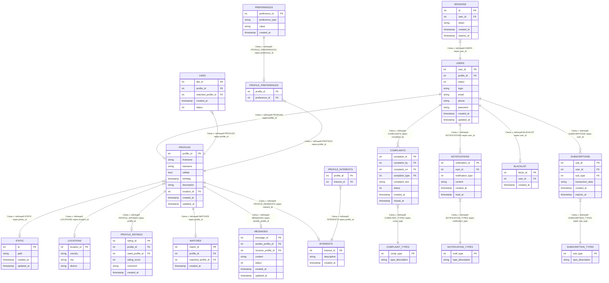

# ER Диаграмма базы данных

```mermaid
erDiagram

    STATIC {
        int id PK
        string path
        timestamp created_at
        timestamp updated_at
    }

    SESSIONS {
        int id PK
        int user_id FK
        string token
        timestamp created_at
        timestamp expires_at
    }

    USERS {
        int user_id PK
        int profile_id FK
        int status
        string login
        string email
        string phone
        string password
        timestamp created_at
        timestamp updated_at
    }

    PROFILES {
        int profile_id PK
        string firstname
        string lastname
        bool isMale
        timestamp birthday
        string description
        int location_id FK
        timestamp created_at
        timestamp updated_at
    }

    INTERESTS {
        int interest_id PK
        string description
        timestamp created_at
    }

    PROFILE_INTERESTS {
        int profile_id FK
        int interest_id FK
    }

    PREFERENCES {
        int preference_id PK
        string preference_type  
        string value            
        timestamp created_at
    }

    PROFILE_PREFERENCES {
        int profile_id FK
        int preference_id FK
    }

    LOCATIONS {
        int location_id PK
        string country
        string city
        string district
    }

    MESSAGES {
        int message_id PK
        int sender_profile_id FK
        int receiver_profile_id FK
        string content
        int status
        timestamp created_at
        timestamp updated_at
    }

    LIKES {
        int like_id PK
        int profile_id FK
        int matched_profile_id FK
        timestamp created_at
        int status
    }

    MATCHES {
        int match_id PK
        int profile_id FK
        int matched_profile_id FK
        timestamp created_at
    }

    SUBSCRIPTIONS {
        int sub_id PK
        int user_id FK
        int sub_type FK
        string transaction_data
        timestamp created_at
        timestamp expires_at
    }

    SUBSCRIPTION_TYPES {
        int sub_type PK
        string type_description
    }

    COMPLAINTS {
        int complaint_id PK
        int complaint_by FK
        int complaint_on FK
        int complaint_type FK
        string complaint_text
        int status
        timestamp created_at
        timestamp closed_at
    }

    COMPLAINT_TYPES {
        int comp_type PK
        string type_description
    }

    BLACKLIST {
        int block_id PK
        int user_id FK
        timestamp created_at
    }

    NOTIFICATIONS {
        int notification_id PK
        int user_id FK
        int notification_type
        string content
        timestamp created_at
        timestamp read_at
    }

    NOTIFICATION_TYPES {
        int notif_type PK
        string type_description
    }

    PROFILE_RATINGS {
        int rating_id PK
        int profile_id FK
        int rated_profile_id FK
        int rating_score
        string comment
        timestamp created_at
    }

    %% Связи

    SESSIONS }|--|| USERS : "Связь с таблицей USERS через user_id"
    USERS ||--o| PROFILES : "Связь с таблицей PROFILES через profile_id"
    USERS ||--o{ COMPLAINTS : "Связь с таблицей COMPLAINTS через complaint_by"
    USERS ||--o| BLACKLIST : "Связь с таблицей BLACKLIST через user_id"
    USERS ||--o{ NOTIFICATIONS : "Связь с таблицей NOTIFICATIONS через user_id"
    USERS ||--o{ SUBSCRIPTIONS : "Связь с таблицей SUBSCRIPTIONS через user_id"

    PROFILES }|--o| STATIC : "Связь с таблицей STATIC через photo_id"
    PROFILES }|--o| LOCATIONS : "Связь с таблицей LOCATIONS через location_id"
    PROFILES ||--o| PROFILE_RATINGS : "Связь с таблицей PROFILE_RATINGS через profile_id"
    PROFILES ||--o| MATCHES : "Связь с таблицей MATCHES через profile_id"
    PROFILES ||--o| MESSAGES : "Связь с таблицей MESSAGES через sender_profile_id"
    PROFILES ||--o| INTERESTS : "Связь с таблицей PROFILE_INTERESTS через interest_id"
    PROFILE_INTERESTS }|--|| INTERESTS : "Связь с таблицей INTERESTS через profile_id"
    

    LIKES }|--|| PROFILES : "Связь с таблицей PROFILES через profile_id"

    PREFERENCES ||--o| PROFILE_PREFERENCES : "Связь с таблицей PROFILE_PREFERENCES через preference_id"
    PROFILE_PREFERENCES }|--|| PROFILES : "Связь с таблицей PROFILES через profile_id"

    SUBSCRIPTIONS }|--|| SUBSCRIPTION_TYPES : "Связь с таблицей SUBSCRIPTION_TYPES через sub_type"
    COMPLAINTS }|--|| COMPLAINT_TYPES : "Связь с таблицей COMPLAINT_TYPES через comp_type"

    NOTIFICATIONS }|--|| NOTIFICATION_TYPES : "Связь с таблицей NOTIFICATION_TYPES через notification_type"

```
